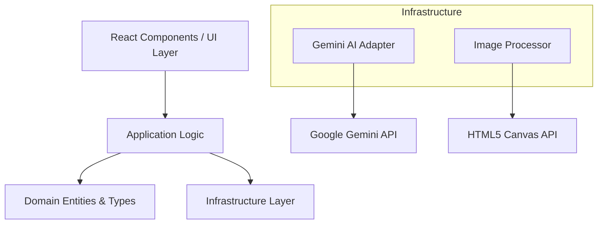

# Architecture Overview - MussPro

MussPro is built on a modular architecture that separates concerns between the UI, business logic, and external AI services.

## Layer Diagram

## Core Components

### 1. Gemini AI Adapter
The `GeminiAIAdapter` is the heart of the AI integration. It orchestrates the multimodal request by:
- **Blackout Zones**: Masking areas where items are placed to help the AI understand depth.
- **Prompt Engineering**: Building dynamic prompts based on "Strict" vs "Generative" item behaviors.
- **Reference Images**: Sending individual product photos to guide the AI's visual generation.

### 2. Image Processor
Handles client-side image manipulation:
- **Perspective Warping**: Adjusting item coordinates to match room depth.
- **Canvas Rendering**: Generating the "Blueprint" image sent to the AI.

### 3. Domain Model
All interactions are governed by the `PlacedItem` and `DecorationItem` types, ensuring consistency across the app.

## Data Flow

1. **Capture**: User takes a photo of the room (`CameraCapture`).
2. **Select**: User chooses items from the `DecorationCarousel`.
3. **Place**: Items are positioned and perspective points are set.
4. **Render**: 
    - `ImageProcessor` masks the base image.
    - `GeminiAIAdapter` sends the masked image + composite + reference images to Gemini.
    - Gemini returns the realistic render.
5. **Review**: User compares the result using the `ComparisonSlider`.
