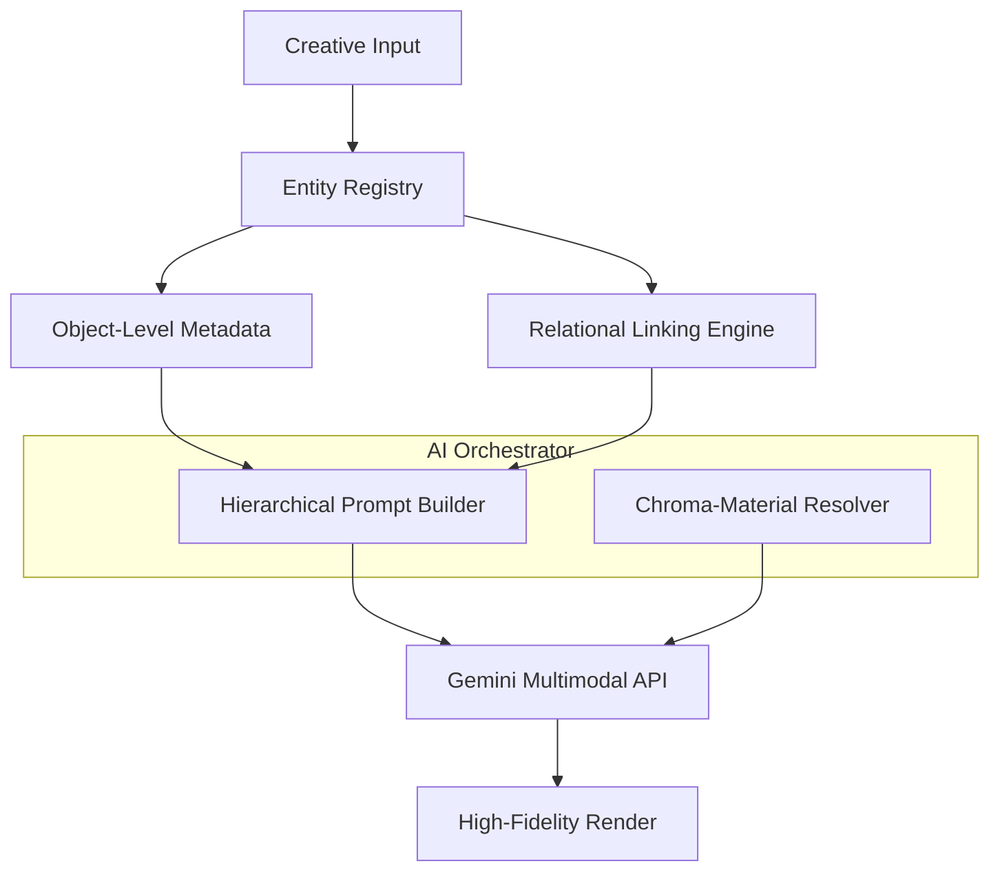

# Architectural Identity - OveShop

OveShop is a **Hierarchical AI Orchestration Suite** designed for extreme precision in multimodal generation. Its architecture enables the control of complex scenes with dozens of entities through a granular prompting engine.

## ⚜️ Functional Pillars

### 1. Hierarchical Prompting Architecture (HPA)
The system decomposes a scene into a tree of executable instructions:
- **Object-Level Prompts**: Each asset (layer) maintains its own metadata (e.g., "Texture: Red Lava Stone").
- **Relational AI (Linked Groups)**: Objects can be semantically connected. A "Stone" and "Water" layer can be linked with a relationship prompt ("water flowing out of the stone"). The engine ensures the AI respects this physical interaction.
- **Massive Orchestration**: Optimized to handle high-density scenes (50+ objects). Each entity’s position, posture, and material are tracked independently and synthesized into a structured context for Gemini-Pro.

### 2. Semantic Mapping (Ink & Typography)
Control through chroma-material affinity:
- **Semantic Ink**: Stroke colors map to material properties (Metal, Glow, Depth). Drawing a "blue neon" stroke over a surface instructs the AI to treat it as a light source.
- **Material Typography**: Rich text colors encode physical depth. Brown text on a stone background can be mapped as a "Deep Engraving", causing the AI to generate appropriate shadows and textures.

### 3. Geometric AI Guidance (Fast Deformation)
- **Perspective Blueprinting**: Quick distortion of assets helps the AI understand the intended 3D space, minimizing hallucinations and ensuring strict alignment with the base photo's geometry.

## Technical Execution Flow

## Core Modules
- **`relationGroups` (State)**: Manages semantic links between disparate layers.
- **`GeminiAIAdapter`**: Synthesizes the hierarchy into a unified multimodal request.
- **`DrawingElement` / `TextProperties`**: Encodes material intent based on color selection.
