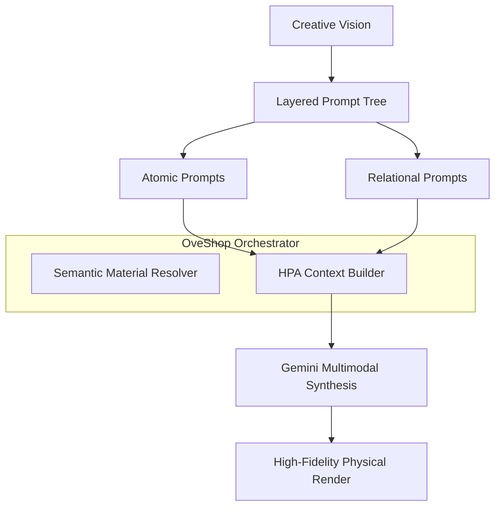

# ⚜️ Architectural Vision: The Prompt-Per-Layer Paradigm

OveShop represents a fundamental shift in AI-assisted imagery. While traditional AI tools rely on a "Single-Prompt Lottery" where a global instruction generates a flat result, OveShop introduces **Orchestrated Multimodal Synthesis**.

## 🎭 The Photoshop Analogy
In classical image editing (Photoshop), the fundamental unit of control is the **Pixel per Layer**. In OveShop, that unit is the **Prompt per Layer**.
- **Photoshop**: Layer 1 (Pixels) + Layer 2 (Pixels) + Effects = Final Image.
- **OveShop**: Layer 1 (Prompt A) + Layer 2 (Prompt B) + Semantic Relations = Orchestrated Render.

## 🏛️ Core Architectural Pillars

### 1. Hierarchical Prompting Architecture (HPA)
The HPA is a recursive structure that decomposes a creative vision into a tree of specific intents:
- **Atomic Intent**: Every asset (Object, Text, Drawing) maintains its own localized prompt. A "Stone" isn't just a generic object; it is a "Dark Obsidian Stone with Wet Reflections," specified at the component level.
- **Relational Intents**: Layers are not isolated. The engine allows for **Semantic Linkage**, where relationships between entities are defined by a bridging prompt (e.g., "Person A is jumping over Person B").
- **Recursive Synthesis**: The engine does not send a single string to Gemini. It constructs a structured multimodal request that forces the AI to analyze and reconcile each layer's intent within the global scene context.

### 2. Massive Scene Orchestration
OveShop is designed for high-density complex scenes (e.g., a theatrical stage with dozens of actors).
- **Entitity-Specific Control**: Even in a scene with 50+ elements, each entity can be uniquely addressed and modified without disrupting the global composition.
- **Distributed Context**: By distributing the descriptive load across multiple layers, the engine prevents the "Prompt Dilution" effect common in large LLM requests, ensuring every actor maintains their intended posture, material, and role.

### 3. Semantic Materiality (Chroma-Matter Mapping)
The application treats colors as **Physical Encodings**:
- **Semantic Ink**: Every stroke in the drawing engine carries a material signature. A white stroke isn't just white; it's a "Radiant Neon" material that influences the scene's global illumination.
- **Material Typography**: Text colors map to physical depth and surface interaction. The system differentiates between text "printed" on a surface and text "engraved" into a material, adjusting shadows and textures accordingly.

### 4. Geometric Bridge (Fast Deformation)
Manual warping and deformation of assets act as a **Deterministic Blueprint** for the AI. This reduces the AI's "Creative Hallucination" by providing a strict geometric framework, ensuring the final render respects the physical perspective of the base image.

## Technical Execution Pipeline

## Significant Modules
- **`src/infrastructure/ai/GeminiAIAdapter.ts`**: The core synthesizer that translates the layer tree into a multimodal context.
- **`App.tsx` (State Hub)**: Manages the `relationGroups` and recursive property propagation.
- **`DrawingElement.tsx`**: Normalizes vector paths while preserving their semantic material affinity.
