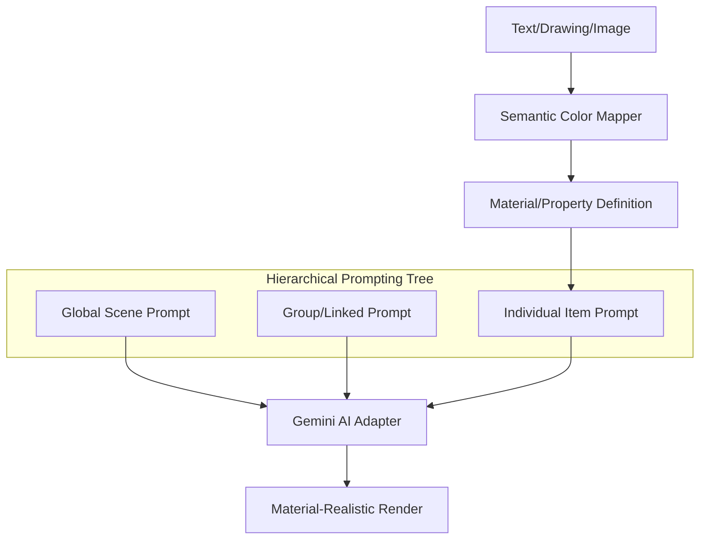

# Architectural Identity - OveShop

OveShop is not a generic image editor; it is a **Hierarchical AI Orchestrator** designed to bridge the gap between abstract intent and physical materiality through a unique multi-prompt and semantic mapping architecture.

## ⚜️ Distinctive Pillars

### 1. Hierarchical Prompting Architecture (HPA)
Unlike standard AI tools that use a single global prompt, OveShop implements a **layered prompting tree**:
- **Atomic Prompts**: Every asset (layer) possesses its own independent metadata. You can specify that a "Stone" asset should be "Lava Red" without affecting the rest of the scene.
- **Linked Entities**: Multiple layers can be grouped into "Entidades Enlazadas". This allows for complex relationships where individual layer prompts coexist with a group-level behavioral prompt.
- **Global Synthesis**: The engine aggregates this tree into a structured multimodal request, ensuring the AI understands the distinction between background, individual objects, and their specific modifications.

### 2. Semantic Ink Engine (Drawing-to-Material)
Drawing in OveShop is a semantic operation, not just a visual one:
- **Property-Encoded Strokes**: Every stroke color in the custom palette is linked to a **Material Property** (e.g., depth, emissivity, roughness).
- **Material Glossary**: Users can assign properties like "Etched Wood" or "Engraved Metal" to specific colors. The AI interprets these colors as material instructions rather than flat pigments.

### 3. Semantic Typography (Material-Aware Text)
Text interactions in OveShop are physics-aware:
- **Chroma-Encoded Depth**: Colors in rich text components are mapped to physical properties. A brown text color might signify a "Deep Engraving", while a neon-blue indicates "Self-Emitting Glow".
- **Inter-Layer Awareness**: When text is placed over a specific background material, the AI cross-references the text property to determine interaction (shadows, reflections, textures).

### 4. Fast Deformation (AI Guidance Bridge)
The system allows for **Rapid Geometric Pre-processing**:
- **Warping for AI**: Assets can be quickly deformed or skewed to match the perspective and geometry of the base photo.
- **Post-Processing Support**: This manual deformation serves as a "blueprint" that helps the AI minimize hallucinations during the final rendering pass, ensuring the generated assets align perfectly with the scene's physics.

## Technical Implementation Logics

